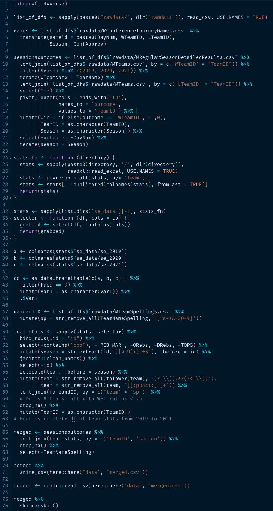

# This repository is a portfolio with some of my work in R and Python.

| Application             | Description                                             | Language | Link to Project                                                                                                    |
| ----------------------- |:------------------------------------------------------- | -------- | ------------------------------------------------------------------------------------------------------------------ |
| Statistical Computation | Bootstrapping Logistic Regression                       | R        | [bootstrapping_logistic_reg.Rmd](https://github.com/despresj/portfolio/blob/main/R/bootstrapping_logistic_reg.Rmd) |
| Statistical Computation | False Discovery Rate                                    | R        | [genomics.Rmd](https://github.com/despresj/portfolio/blob/main/R/genomics.Rmd)                                     |
| Statistical Computation | Monte Carlo Simulation                                  | R        | [monte_carlo_methods.Rmd](https://github.com/despresj/portfolio/blob/main/R/monte_carlo_methods.Rmd)               |
| Statistical Computation | Rewriting lm() function in R                            | R        | [my_lm.Rmd](https://github.com/despresj/portfolio/blob/main/R/my_lm.Rmd)                                           |
| Classification Problem  | Predict the outcome of basketball games                 | R        | [March Madness](https://github.com/despresj/March-Madness)                                                         |
| Algorithm               | Gauss–Seidel method for inverting a matrix              | R        | [gauss_seidel_algo.R](https://github.com/despresj/portfolio/blob/main/R/gauss_seidel_algo.R)                       |
| Data Wrangling          | Reading and cleaning Gapminder Data                     | R        | [cleaningscript.R](https://github.com/despresj/portfolio/blob/main/R/cleaningscript.R)                             |
| Forecasting             | Evaluating forecasting methods using stock market data  | R        | [stock_forcasting.Rmd](https://github.com/despresj/portfolio/blob/main/R/stock_forcasting.Rmd)                     |
| Productivity            | Random interval timer                                   | R        | [random_interval_timer.R](https://github.com/despresj/portfolio/blob/main/R/random_interval_timer.R)               |
| Web Scraping            | Scraping March Madness Tournament Results               | R        | [webscraping.R](https://github.com/despresj/portfolio/blob/main/R/webscraping.R)                                   |
| Statistical Computation | Best Subsets selection                                  | Python   | [subset_selection.ipynb](https://github.com/despresj/pythonChallenges/blob/master/pandas/student_debt.ipynb)       |
| Statistical Computation | Generate many regression models                         | Python   | [many_models.ipynb](https://github.com/despresj/pythonChallenges/blob/master/pandas/many_models.ipynb)             |
| Password Generator      | Password generator and manager                          | Python   | [password_generator.py](https://github.com/despresj/portfolio/blob/main/Python/password_generator.py)              |
| Password Generator      | Retrieves generated password                            | Python   | [password_generator_ret.py](https://github.com/despresj/portfolio/blob/main/Python/password_generator_ret.py)      |
| Productivity            | Removes '>' symbol from copied text                     | Python   | [symbolRemover.py](https://github.com/despresj/portfolio/blob/main/Python/symbolRemover.py)                        |
| Data Analysis           | Exploring Numpy                                         | Python   | [numpyexplore.py](https://github.com/despresj/portfolio/blob/main/Python/numpyexplore.py)                          |
| File Management         | Put all code contained in a directory into one .md file | Python   | [codeToText.py](https://github.com/despresj/portfolio/blob/main/Python/codeToText.py)                              |

